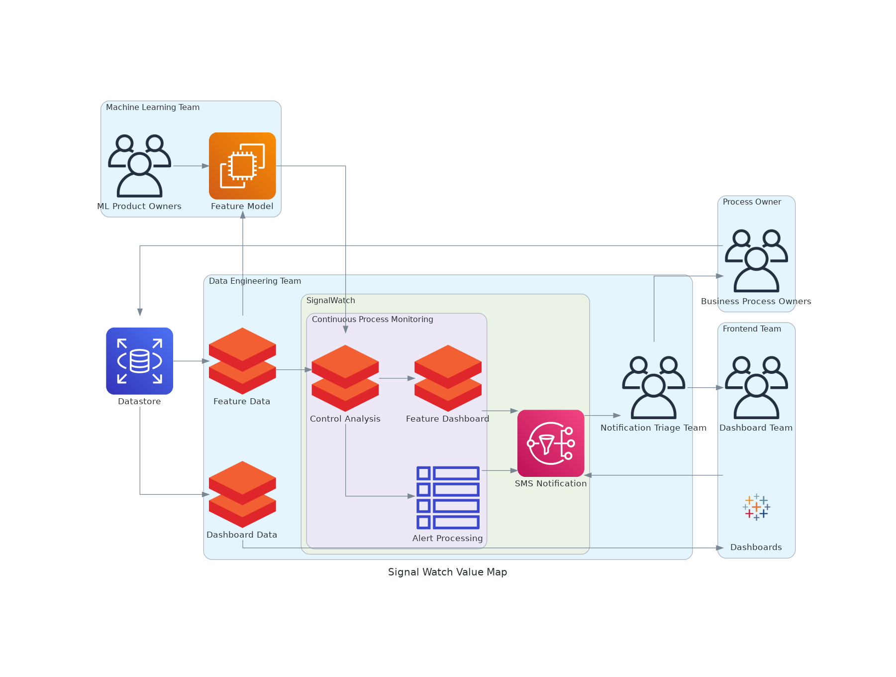
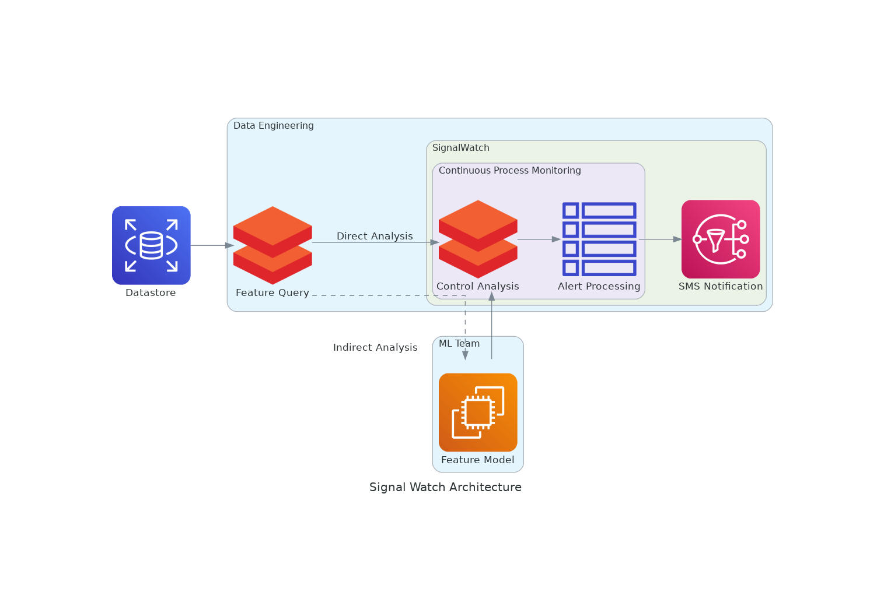

# Design Document Outline

## Stakeholder Value Map

## Process Flow Chart

## 1. Data_Source

* Description: The source table from which raw data is collected. This data might reside in a Databricks Delta table or another data store.
* Responsibilities:
    - Store raw event data.
    - Provide a reliable source for data retrieval.
* Interactions:
    - Queried by the Preprocess_Operation service to fetch relevant data.

## 2. Preprocess_Operation

* Description: This operation queries the source data, applies necessary transformations, and converts the data into a feature format suitable for control analysis.
* Responsibilities:
    - Extract and transform data.
    - Format data into a structured schema required for control analysis.
* Interactions:
    - Fetches data from Data_Source.
    - Passes preprocessed data to Control_Analysis.

## 3. Control_Analysis

* Description: This service performs the actual control analysis on the preprocessed data, such as generating control charts.
* Responsibilities:
    - Analyze feature data using appropriate control chart methodologies.
    - Identify any out-of-control processes or significant deviations.
* Interactions:
    - Receives data from Preprocess_Operation.
    - Outputs results to Control_Runs and Control_Signals.

## 4. Control_Runs

* Description: Stores the results of each control analysis run, including calculated metrics and control chart data.
* Responsibilities:
    - Maintain a history of all control analysis runs.
    - Provide a record of analysis outcomes for audit and review.
* Interactions:
    - Populated by Control_Analysis.
    - Referenced by Control_Signals for signal generation.

## 5. Control_Signals

* Description: Handles the detection of signals or alerts based on control analysis results, triggering any necessary notifications.
* Responsibilities:
    - Identify signals indicating out-of-control processes.
    - Log signals and forward them to the notification system.
* Interactions:
    - Processes results from Control_Runs.
    - Triggers Notification_System when signals are detected.

## 6. Notification_System

* Description: This service is responsible for sending out notifications (e.g., emails) when signals are generated from control analysis.
* Responsibilities:
    - Send email alerts with HTML content.
    - Manage notification templates and delivery mechanisms.
* Interactions:
    - Activated by Control_Signals.
    - Sends notifications to stakeholders.

## Explanation of the Diagram

* Data Pipeline Cluster:
    - Data_Source (S3): Represents the raw data storage.
    - Preprocess_Operation (Spark): Symbolizes the ETL process.
    - Control_Analysis (Spark): Represents the control analysis logic.
    - Control_Runs (Postgresql): Stores the results of each analysis run.
    - Control_Signals (Postgresql): Manages the signals generated from the analysis.

* Notification System Cluster:
    - Email Service (Django): Depicts the notification system sending out alerts.
    - Users: Represents the stakeholders receiving the notifications.

## Deliverables

* Design Document: A detailed document outlining each service's responsibilities, interactions, and how they work together within the framework.
* Diagrams Script: The Python script using the diagrams package to visualize the architecture.
* Generated Diagram: A visual diagram (e.g., PNG or PDF) created using the diagrams script, providing a clear overview of the architecture.

These deliverables will guide the development and deployment of the control analysis system, ensuring each component is well-integrated and the entire process is streamlined.
